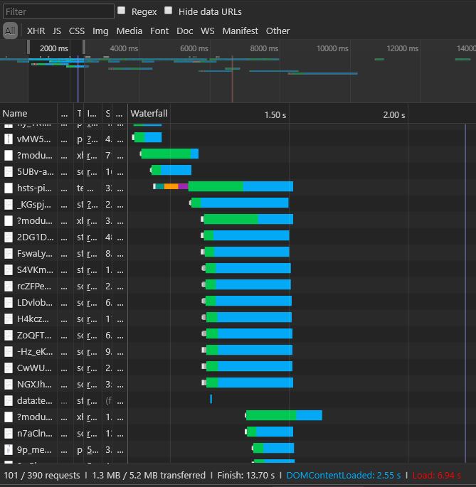

## Hey guys and gals

---

## I'm [Carding](https://github.com/richardneililagan).

<p class="fragment">I make stuff for [DXC.technology](https://www.dxc.technology).</p>

<blockquote class="fragment">
[github.com/richardneililagan](https://github.com/richardneililagan)<br/>
[@techlifemusic](https://twitter.com/techlifemusic)<br/>
</blockquote>
<blockquote class="fragment">
[PH Technology Hackers (phackers.com)](https://phackers.com)
</blockquote>

---

<!-- .slide: class="flush-left" -->
# <span class="accent">Critical Path</span> CSS

Concepts and Buzzwords to Impress Your Boss With

---

Point:

## Page load speed is <span class="accent">important</span>.

-

## A <span class="accent">one-second</span> delay in load time:

- Decreases conversions by around <span class="accent">7%</span> on average
- Increases bounce rate by <span class="accent">11%</span> on average

<p class="footnote flush-left">&mdash; [Akamai](akamai.com)</p>

note:

Assuming a PHP 5000 / day margin:

- **PHP 127,750** loss every year on a one-second delay

---

> Amazon potentially loses <span class="accent">USD 1.6 billion</span>
> if their pages loaded one second slower.

Amazon <!-- .element class="footnote" -->

note:

### Amazon 2016

- Revenue is USD 136 billion (1.1%)
- Profit is USD 47.7 billion (3.35%)

-

> Traffic to Yahoo! pages could <span class="accent">increase by 9%</span>
> if they could reduce page load times by <span class="accent">0.4 seconds</span>.

Yahoo <!-- .element class="footnote" -->

-

> A reduction of <span class="accent">2.2 seconds</span> in page load times
> can increase downloads by <span class="accent">15.4%</span>.

Mozilla <!-- .element class="footnote" -->

---

How does all this relate to me, <br/> as a CSS developer?

---

### Page load "speed"

| Metrics |
|:---:|
| Time to Interact |
| Time to First Byte |
| Load Time |
| Time to Rendering Start |
| Page Size |
| Resource Requests |
| <em>etc...</em> |

---

## Time to Render

<blockquote class="fragment">
Relates to the amount of time it takes until a page is fully rendered.
</blockquote>

-



---

Problem #1:

### External CSS files generally block rendering.

-

```
<!doctype html>
<html>
<head>
  ...
  <link rel="stylesheet" href="styles.css">
  ...
</head>
...
```

note:

- Browser needs both DOM and CSSOM to create a render tree
- Potential solution is to remove the CSS from the rendering path.
- Also why we avoid `@import`

-

```javascript
function loadCssAsync (url) {
  // 1. request for CSS file using XHR
  // 2. create a <style> element
  // 3. inject the CSS file contents into the element
  // 4. attach the element onto the DOM
}

// ...

loadCssAsync('//styles.css')
```
---

Problem #2:

### We generally want CSS files to block rendering.

-

### FOUC!


-

Inline the styles instead?

```html
<style>
  * { box-sizing: border-box; }
  /* ... */
</style>
<!-- content -->
```

note:

- The whole markup is also the whole stylesheet
- No need for additional HTTP requests; no add'l overhead

---

Problem #3:

### Inlining styles bloat up the whole page lifecycle

-

#### When you inline your whole stylesheet onto the page:

- Caching benefits are virtually eliminated completely <!-- .element: class="fragment" -->
- The whole "stylesheet" is downloaded again on every page load <!-- .element: class="fragment" -->

---

## Recap
