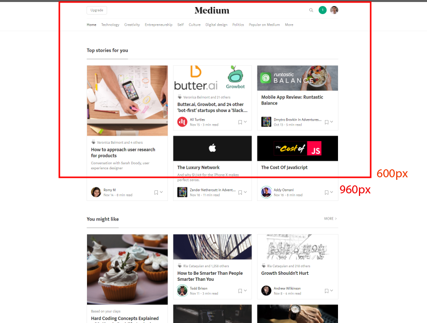
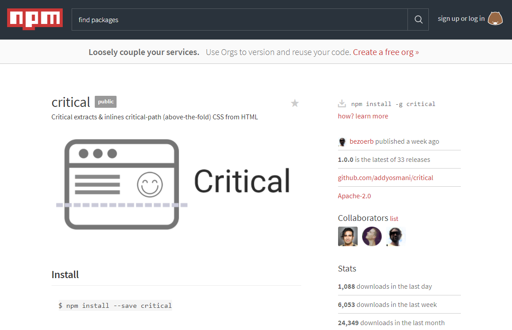

## Hey guys and gals

---

## I'm [Carding](https://github.com/richardneililagan).

<p class="fragment">I make stuff for [DXC.technology](https://www.dxc.technology).</p>

<blockquote class="fragment">
[github.com/richardneililagan](https://github.com/richardneililagan)<br/>
[@techlifemusic](https://twitter.com/techlifemusic)<br/>
</blockquote>
<blockquote class="fragment">
[PH Technology Hackers (phackers.com)](https://phackers.com)
</blockquote>

---

<!-- .slide: class="flush-left" -->
# <span class="accent">Critical Path</span> CSS

Concepts and Buzzwords to Impress Your Boss With

---

Point:

## Page load speed is <span class="accent">important</span>.

-

## A <span class="accent">one-second</span> delay in load time:

- Decreases conversions by around <span class="accent">7%</span> on average
- Increases bounce rate by <span class="accent">11%</span> on average

<p class="footnote flush-left">&mdash; [Akamai](akamai.com)</p>

note:

Assuming a PHP 5000 / day margin:

- **PHP 127,750** loss every year on a one-second delay

---

### Page load "speed"

| Metrics |
|:---:|
| Time to Interact |
| Time to First Byte |
| Load Time |
| Time to Rendering Start |
| Page Size |
| Resource Requests |
| <em>etc...</em> |

---

## Time to Render

<blockquote class="fragment">
How long does it take for the page to be fully rendered?
</blockquote>

-


---

## The critical render path

1. Request for HTML payload
2. Parse HTML payload and identify assets
3. Determine and download critical assets
4. Create / update the document render tree
5. Perform render

note:

We're most interested in optimizing (3).

-

| Optimizing our critical path |
|:---:|
| Minimize the payload size of the critical path |
| Minimize the amount of critical resources |

note:

How does this relate to me, as a CSS developer?

---

Consideration #1:

### External CSS files generally block rendering.

-

```html
<!doctype html>
<html>
<head>
  ...
  <link rel="stylesheet" href="styles.css">
  ...
</head>
...
```

note:

- Browser needs both DOM and CSSOM to create a render tree
- Potential solution is to remove the CSS from the rendering path.
- Also why we avoid `@import`

-

```css
@import 'utility.css';
...
```

-

Load the CSS files asynchronously instead?

```javascript
function loadCssAsync (url) {
  // 1. request for CSS file using XHR
  // 2. create a <style> element
  // 3. inject the CSS file contents into the element
  // 4. attach the element onto the DOM
}

// ...

loadCssAsync('//styles.css')
```
---

Consideration #2:

### We generally want CSS files to block rendering.

-

### FOUC!


-

Inline the styles instead?

```html
<style>
  * { box-sizing: border-box; }
  /* ... */
</style>
<!-- content -->
```

note:

- The whole markup is also the whole stylesheet
- No need for additional HTTP requests; no add'l overhead

---

Consideration #3:

### Inlining styles bloat up the whole page lifecycle

-

#### When you inline your whole stylesheet onto the page:

- Caching benefits are virtually eliminated completely <!-- .element: class="fragment" -->
- The whole "stylesheet" is downloaded again on every page load <!-- .element: class="fragment" -->
- Potentially a pain in the derrière to maintain <!-- .element: class="fragment" -->

---

# So, yeah.

-

| Optimizing our critical path |
|:---:|
| Minimize the payload size of the critical path |
| Minimize the amount of critical resources |

---

Attack #1:

## <span class="accent">Combine</span><br> related stylesheets together.

note:

- minimizes total file size due to redundant checking
- minimizes network overhead
  - time and size component

---

Attack #2:

## <span class="accent">Properly qualify</span> stylesheets

-

<span class="accent">Remember:</span> The browser tries to determine which assets are critical to rendering.

```html
<link rel="stylesheet" href="a.css">
<link rel="stylesheet" href="a.css" media="orientation:portrait">
<link rel="stylesheet" href="a.css" media="(min-width: 600px)">
<link rel="stylesheet" href="a.css" media="print">
```

---

Attack #3:

## <span class="accent">Inline</span> critical styles

and defer the others.

-



-



-

> https://npmjs.com/package/critical

```bash
# :: I use it as a CLI tool

npm install -g critical

cat index.html | critical --inline > index.critical.html
```

---

## Why wouldn't I want to do this?

-

It can get really tedious.

-

You _still_ lose caching benefits.

-

You forego optimizations that happen on-demand.

note:

see discussion on browsers determining what critical assets are

-

HTTP/2 deprecates a lot of the workarounds we've described above.

-

Don't even get me started on SPAs.

---

## General recommendations

1. Inline anything below 1 KB.
2. Don't inline anything that is _not_ relevant above the fold.
3. Ensure you're properly scoping your stylesheets.

---

### Thanks for listening.

If you have questions, feel free to approach me anytime after the talk as well.
